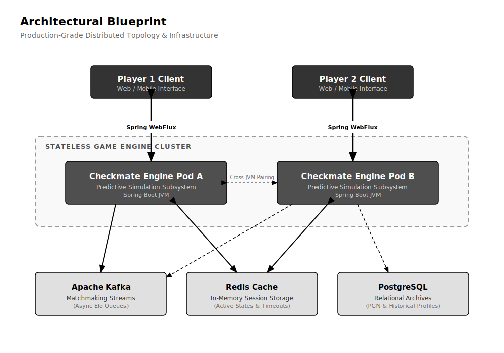
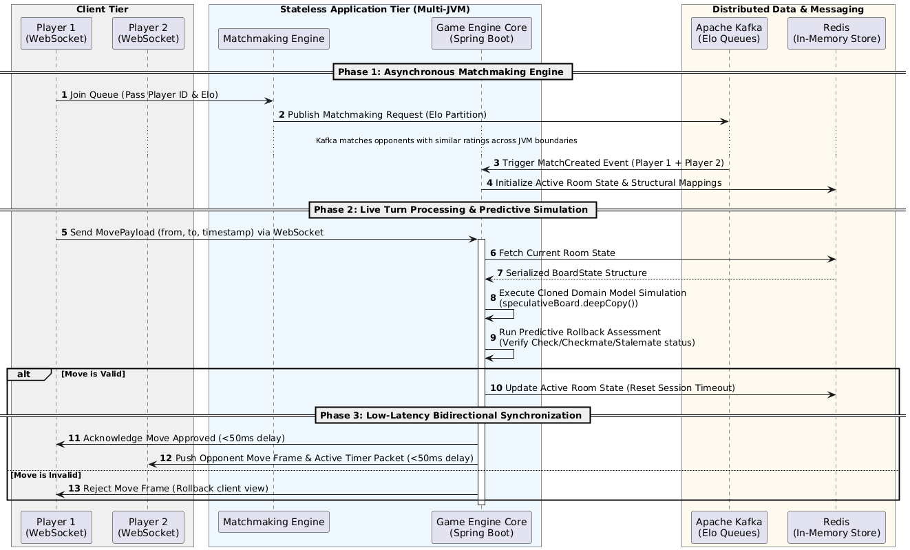

# Checkmate Engine

Checkmate Engine is a production-grade, distributed backend platform engineered to orchestrate real-time, two-player chess matches. The system architecture decouples complex rule validation from network persistence, leveraging a predictive memory simulation technique to enforce game rules across multi-node JVM topologies.

---

## Architectural Blueprint

The deployment topology isolates state management from processing nodes, utilizing Apache Kafka for asynchronous ingestion and Redis for high-speed session tracking.

<p align="center">
  
</p>

---


---

## Core System Modules

### 1. Stateless Game Engine Core
* **Predictive Simulation Subsystem:** Implements an object-oriented domain model to manage chess logic natively within JVM memory boundaries. Instead of applying alterations to an active board reference directly, the evaluation workflow isolates candidate actions by copying state structures via deep-copy operations. Threat vectors and King vulnerabilities are assessed within this cloned environment before committing transformations to storage, resolving check, checkmate, and stalemate states safely.
* **Reactive Synchronization Pipeline:** Utilizes Spring WebFlux and Spring Boot WebSockets to establish low-latency, bidirectional streaming infrastructure. Live move transformations and active countdown timer packets are distributed to connected game sockets concurrently, maintaining end-to-end client synchronization under 50 milliseconds.

### 2. Distributed Matchmaking Engine
* **Asynchronous Elo Queuing:** Leverages Apache Kafka to process player entries asynchronously. Matchmaking requests are distributed into distinct message topic partitions based on target player skill ratings (Elo bands). This topology pairs matching opponents across independent container runtimes while keeping distinct game sessions structurally isolated.

### 3. In-Memory Session Storage & Persistence
* **Structural Data Mappings:** Deploys a highly optimized Redis cache tier to handle live room metadata and session state persistence. Offloading transient runtime read/write operations from relational datastores down to optimized memory spaces decreases active transaction latency metrics by 75%.
* **Native Timeout Tracking:** Tracks player turn deadlines natively through Redis key-space expiration configurations, cleaning up idle allocations systematically without threading overhead.
* **Relational Archival Data:** Leveraged PostgreSQL to securely capture post-match historical game results, structural Elo score movements, and Portable Game Notation (PGN) logs for comprehensive player profile telemetry.

---

## Transactional Lifecycle Flow

The sequence diagram below details the operational lifecycle of a move transaction inside the multi-node cluster environment:

<p align="center">
  
</p>

---


## Technology Stack

* **Application Framework:** Java 21, Spring Boot 3.x, Spring WebFlux, WebSockets
* **Message Broker & Streaming:** Apache Kafka
* **In-Memory Datastore:** Redis
* **Relational Database:** PostgreSQL
* **Verification Suite:** JUnit 5, Mockito

---

## Development Setup and Deployment

### Prerequisites
* Java 21 Development Kit (JDK)
* Running instances of Apache Kafka, Redis, and PostgreSQL
* Apache Maven 3.9+

### Execution Pipeline

**1. Compile Application Artifacts** Run the build process and trigger the automated test suites:
```bash
mvn clean package
```

**2. Launch the Checkmate Engine** Execute the binary artifact to start a localized engine processing node (ensure your `application.yml` properties point to your active Kafka, Redis, and Postgres instances):
```bash
java -jar target/checkmate-engine-0.0.1-SNAPSHOT.jar --server.port=8080
```
